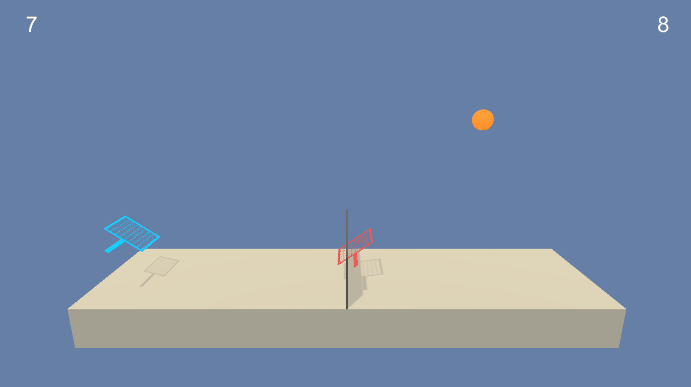

# Collaboration and Competition
This is the P3 project for the Deep Reinforcement Learning Nanodegree on https://www.udacity.com/.

In the environment, two agents control rackets to hit a ball over a net. A reward of `0.1` is given to the agent every time it successfully hits the ball over the net. A reward of `-0.01` is given to the agent that lets the ball hit the ground or hits it out of bounds. The goal of both agents is to keep the ball in play as long as possible.

The state space is comprised of 8 dimensions corresponding to position and velocity of the ball and racket. Each agent recieves it's own, local state. The action space is a 2 number vector corresponding to movement toward (or away from) the net, and jumping. Every number in the action space is between `-1` and `1`.

The problem is solved once either agent has achieved an average score of `0.5` over the last 100 episodes. An example of a trained agent can be seen below:

## Getting started
This was built and **tested on MacBook Pro M1 chip only**.

 1. Clone this project. `git clone https://github.com/bigbap/Udacity_DRL_Continuous_Control.git`
 2. Download the tennis environment from https://drive.google.com/file/d/1nsRxeKqiiY1IzzjRsGpa2fh1P3wFQQvF/view?usp=share_link
 3. extract the contents of the downloaded environment into the cloned project directory.

You will need to install Anaconda from https://www.anaconda.com/products/individual. Once Anaconda is installed, open up the terminal and type the following commands to create a new environment:

 1. `conda create --name collab_compet python=3.6`. This will create a new environment called **collab_compet** where we will install the dependencies.
 2. `conda activate collab_compet`. This will activate the environment we just created.

Now we can install the dependencies:

 1. `pip3 install unityagents`. Should be version 0.4.0
 2. `pip3 install torch`. Should be version 1.9.1

## Training the model
Open `Collab_Compet.ipynb` with **Jupyter Notebook** and follow the instructions to train a new agent.

If you want to watch the trained agent playing, open `Collab_Compet_Play.ipynb` with **Jupyter Notebook** and follow the instructions.

*Note: if you get any errors, please ensure that you have followed all the instructions in the **Getting started** section. Pay special attention to the dependencies and their versions. If you are not sure what packages you have installed, use `conda list` to list all the installed packages and their versions for the activated environment*
