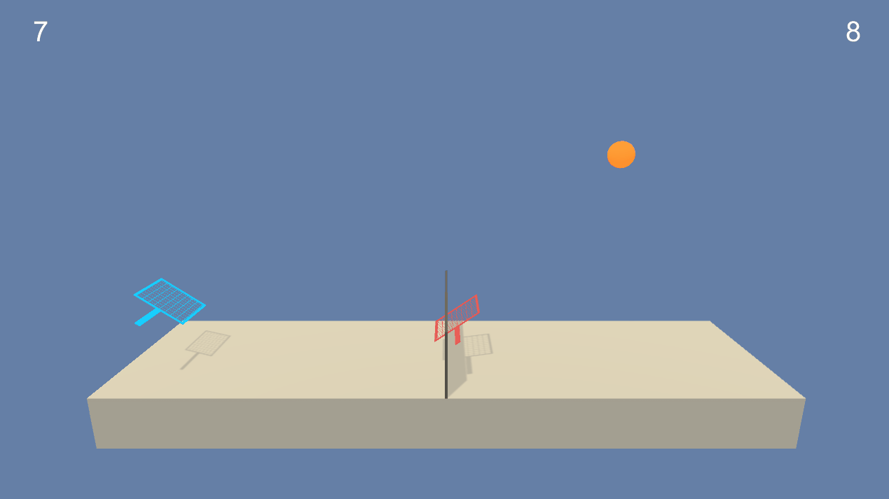

# Report for Collaboration and Competition - Deep RL NanoDegree P3
The goal of this project is to create an agent that can be trained to hit a ball over a net with a racket. This is a multi-agent environment which means that there will be two agents and they must try to keep the ball in the air for as long as possible. A reward of `0.1` is given to the agent every time it successfully hits the ball over the net. A reward of `-0.01` is given to the agent that lets the ball hit the ground or hits it out of bounds.

The environment is solved once either of the two agents has accumulated an average score of 0.5 over 100 episodes. An example of a trained agent can be seen below:

## 1. Implementation
I used the `MADDPG` algorithm, with a `uniformly sampled experience replay buffer`. The `MADDPG` algorithm is derived from the `DDPG` algorithm and modified for multi-agent environments. The key difference is that the critic incorporates the actions from all agents when determining the Q values.

### 1.1. Neurals Nets
There are 2 neural networks. One for the actor and the critic. The environment has a state space size of `8`, but the networks will take the last `3` states as inputs. The action space size is `2`. Bearing that in mind, each neural net has the following fully connected layers:

**Actor**

-  `input layer = linear(s_dim * 3, 128)`
-  `hidden layer = linear(128, 128)`
-  `output layer = linear(128, a_dim)`

The input and hidden layers pass through a `leaky_relu` activation function, and the output layer passes through a `tanh` in the forward pass. There is a `batch normalization` pass before the input goes through the first fully connected layer.

**Critic**

-  `input layer = linear(s_dim * 3, 128)`
-  `hidden layer = linear(128 + a_dim * n_agents, 128)`
-  `output layer = linear(128, 1)`

The input and hidden layers pass through a `leaky_relu` activation function. The output layer does not pass through an activation function. The `a_dim * n_agents` is concatenated to the input of the `hidden layer`. There is a `batch normalization` pass before the input goes through the first fully connected layer.

### 1.2. Hyper-parameters
- BATCH_SIZE = 64 mini-batch size
- REPLAY_LENGTH = 10000 replay buffer max length
- LEARN_EVERY = 1 learning interval
- GAMMA = 0.99 discount factor
- TAU = 1e-3 amount of local network to copy to target in soft update
- LR_ACTOR = 2e-4 learning rate for the actor network
- LR_CRITIC = 2e-4 learning rate for the critic network
- WEIGHT_DECAY = 0 L2 penalty

## 2. Learning Plot
The environment was solved in 832 episodes as can be seen in the plot below.

## 3. Ideas for the Future
- This implementation trains a single agent to play against itself. I would like to try creating separate agents and training them in parallel using a single critic network for both agents.
- Currently, rewards don't have an impact on the opposing agent. I believe this causes the agents to behave more cooperatively. I would be curious to see what would happen if rewards had an opposite effect on the opposing agent. So when `agent A` gets a reward `r`, `agent B` would get a reward `r * -n`, where `n` is some scaling factor.